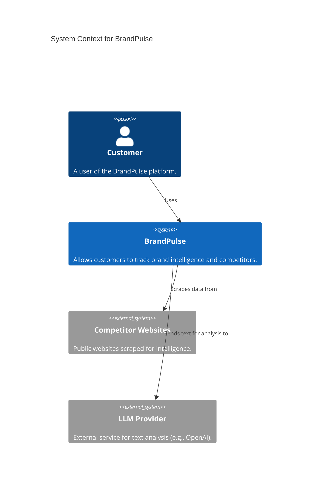
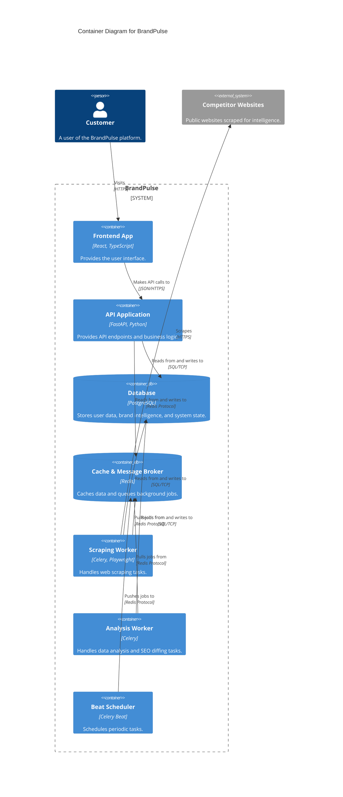

# BrandPulse Architecture

This document describes the high-level architecture of BrandPulse using the C4 model.

## System Context Diagram

## Container Diagram

## Container Responsibilities

- **Frontend App:** The user interface built with React. It communicates with the backend API.
- **API Application (Backend):** The core FastAPI service serving REST endpoints, managing authentication, and handling synchronous business logic.
- **Database (PostgreSQL):** The primary persistent storage for the platform.
- **Cache & Message Broker (Redis):** Used for fast data caching and as the message broker for Celery queues.
- **Scraping Worker:** A Celery worker configured specifically for IO-bound web scraping tasks using Playwright.
- **Analysis Worker:** A Celery worker configured for CPU-bound or external API-bound tasks like data analysis, NLP, and SEO diffing.
- **Beat Scheduler:** Celery Beat service responsible for dispatching periodic background tasks (e.g., daily scraping).
