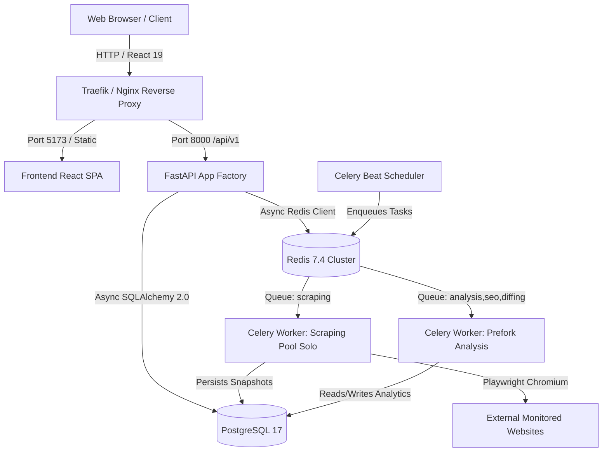

# BrandPulse Operations Runbook

This operational runbook provides production engineering procedures for deploying, maintaining, monitoring, and scaling the BrandPulse platform.

---

## 1. Architecture Topology



---

## 2. Celery Worker Queue Configuration

BrandPulse separates I/O-bound browser automation from CPU-bound algorithmic computation into dedicated task queues:

| Queue Name | Worker Pool | Concurrency | Target Tasks | Rationale |
|---|---|---|---|---|
| `scraping` | `solo` | 1 per container | `crawl_website`, `ad_crawler` | Playwright browser contexts require isolation to prevent async event loop collisions. |
| `analysis` | `prefork` | N CPU cores | `generate_brand_report`, `process_snapshot_products` | Multi-process parallelism for data crunching. |
| `seo` | `prefork` | N CPU cores | `seo_auditor` | Fast DOM parsing and algorithmic scoring across 43+ checks. |
| `diffing` | `prefork` | N CPU cores | `diff_detector` | CPU-bound SequenceMatcher DOM chunk diffing. |

### Starting Workers Locally
```bash
# Scraping worker (Playwright solo pool)
celery -A workers.celery_app worker -Q scraping --pool=solo --loglevel=info

# Analysis worker (prefork pool)
celery -A workers.celery_app worker -Q analysis,seo,diffing --concurrency=4 --loglevel=info

# Beat scheduler for recurring audits
celery -A workers.celery_app beat --loglevel=info
```

---

## 3. Database Maintenance & Indexing

PostgreSQL stores HTML snapshots, time-series price histories, and diff events.

### Recommended Vacuuming & Optimization
```sql
-- Reindex time-series price histories monthly
REINDEX TABLE CONCURRENTLY price_history;

-- Vacuum snapshots to reclaim deleted storage
VACUUM (VERBOSE, ANALYZE) snapshots;

-- Inspect unindexed foreign keys
SELECT conrelid::regclass AS table_name,
       conname AS foreign_key,
       pg_get_constraintdef(c.oid)
FROM pg_constraint c
WHERE contype = 'f'
  AND NOT EXISTS (
    SELECT 1 FROM pg_index i
    WHERE i.indrelid = c.conrelid
      AND conkey::int2[] <@ indkey::int2[]
  );
```

---

## 4. Monitoring & Alerting Thresholds

| Metric | Target / SLA | Alert Threshold | Action Required |
|---|---|---|---|
| Redis Queue Depth (`scraping`) | < 50 pending jobs | > 200 jobs for > 15m | Scale scraping worker replicas. |
| Crawl Failure Rate | < 2% | > 10% in 1 hour | Check target domains for IP blocks or anti-bot updates. |
| API 5xx Response Rate | < 0.05% | > 1% in 5m | Inspect FastAPI error logs for unhandled exceptions. |
| DB Connection Pool Usage | < 60% | > 85% | Increase `max_overflow` in `database.py` or scale pgbouncer. |

---

## 5. Backup & Recovery

### Automated Database Backup
```bash
#!/usr/bin/env bash
TIMESTAMP=$(date +%Y%m%d_%H%M%S)
BACKUP_FILE="/backups/brandpulse_${TIMESTAMP}.sql.gz"
pg_dump -h localhost -U brandpulse -d brandpulse | gzip > "${BACKUP_FILE}"
```

### Restoration
```bash
gunzip -c /backups/brandpulse_20260905.sql.gz | psql -h localhost -U brandpulse -d brandpulse
```
